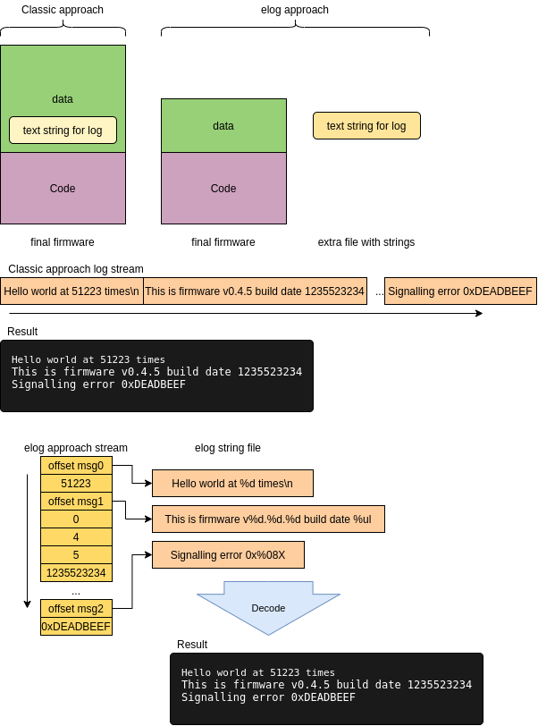

# Embedded Logger

This log system is thinked for embedded systems with mininmal
resource utilization. The log system is designed to minimize
memory compsumition in flash or RAM, enable an eficient in-ram
loggin buffer with very efficient storage.

The main goal of this aproach, consist in move fixed strings
outside of final binary. The big compsumition of memory in any
log system consist in the fixed strings used to format the text.

Our aproach consist to move log strings to a special section in
executable and remove this from final artifact.

The firmware only refer the string as a virtual address (the
pointer of string in discaded area) and append the data to format
(if need).

In the host, the strings are stored in binary format indexable
with the offset of the address contained in log dataset.



## Internal log format

The log is stored in memory as an array of "architecture register
size" data type (by example, in armv7m, the data type is uint32_t)

The first word is an Id formad by a bitfield of offset and 
arghoment count, encoded in convenient way.

By example, for this schema, it reserved 4 bit for arg count (max
of 16 args) and 28 bits for offset.


The `message id` is composed by two fields:

 - string offset in memory: Obtained by masking message id with
 `0x0FFFFFFF`
 - argument count: Obtaining shifting 28 bits rigth the word and
 masking with `0xF`
 - The arguments is `uint32_t` aligned data after the message id
 word.

## Memory layout

Next, you can view the memory layout of ELF in the left, and the
final binary in the middle. This is made by traditional `objcopy`
process but with the section `.log` ignored in the copy.
The `.log` section is previously moved by `objcopy` to the own
binary file. At now, the offset in this file is correlated with
offset in the message id, serialized in logger.


# API and Usage

For usage, you need to define a `LOG` memory area in address
`0x?0000000` (with `?` replaced by any of sector unused in your
chip) and generate section with name `.elog` that contains all of
symbols like `.elog.*`

## Compiler and stdlib support

You only need these files for compile:

 - `inc/elog.h`: Public API
 - `inc/elog-cpp.h`: Preprocessor helper
 - `inc/elog-internal.h`: Internal structures
 - `src/elog.c`: Implementation

Additionally you need the next standar C elements available in your
environment:

 - Implementation of `string.h` for `memcpy` usage
 - At least, definitions in `limits.h`, `stddef.h` and `stdint.h`
 - A preprocessor with `__VA_ARGS__` support (C99 or gnu extension)
 - Compiler with `__section__` attribute support (gnu gcc or clang
   compatible)

## API and usage

You need to initialize a logger object with buffer arena to operate:

```c
static char arena[1024];

...
elog_t *logger = elog_init(arena, sizeof(arena));
```

After this, you can use logger memory buffer to store consecutive
logs. If the space is full, the next log is silently ignored and
need to flush the buffer in order to continue with loggin

For insert new log in the buffer ask:

```c
ELOG(logger, "printf like string format", <variable argument list>);
```

The variable argument list is casted to `msgparam_t` (in this
concrete implementation `uint32_t`) and stored in buffer after
message id.

> NOTE: Due the nature of storage, this not support to store string
format like `%s` specifier... this not work in any form (only store
the memory pointer of the string, maybe invalid at the moment of
the debug)

Before the buffer is full, you need to flush this over a suitable
interface, or move it into secondary storage.

```c
void flush_func(elog_entry_t *e, int len, void *ctx)
{
    /* Flush entry e with len bytes (included header)
     * The pointer ctx is passed as thirth parameter
     * in elog_flush call
     */
}

...
elog_flush(logger, flush_func, function_context);
...
```
